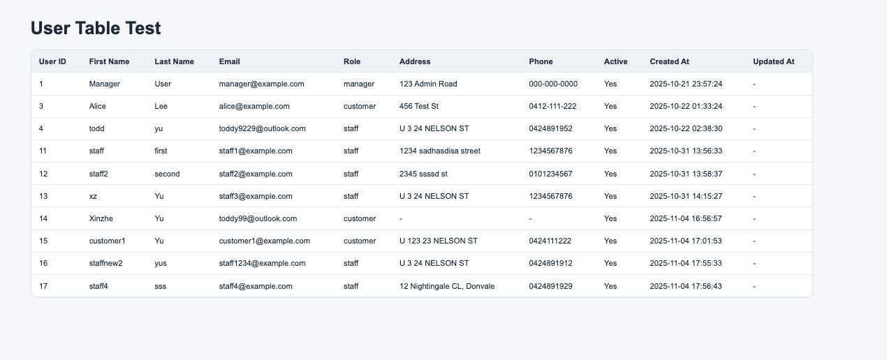

# COS30043 Modern Web Application

## Project Overview

This project is a simple full-stack web application using:

* **Frontend:** Vue 3 + Vite
* **Backend:** PHP (REST-style API)
* **Database:** MariaDB (Swinburne Feenix)

The application currently demonstrates a basic **User table viewer**, where data is fetched from the database and displayed in a table.

---

## Project Structure

```
COS30043-MODERN-WEBAPP/
  ├── api/                # PHP backend (database access)
  │   ├── db.php
  │   └── users.php
  ├── src/                # Vue source code
  ├── public/
  ├── index.html
  ├── package.json
  ├── vite.config.js
  └── README.md
```

---

## Prerequisites

Make sure you have the following installed:

* Node.js (v18+ recommended)
* npm

---

## Setup Instructions

### 1. Clone the repository

```bash
git clone <this-repo-url>
cd COS30043-MODERN-WEBAPP
```

---

### 2. Install dependencies

```bash
npm install
```

---

### 3. Run the frontend (development mode)

```bash
npm run dev
```

Then open:

```
http://localhost:5173
```

---

## Important Notes (Development)

### API Source

The frontend fetches data from:

```
/api/users.php
```

In development, this expects the PHP API to be available on a server (e.g. Mercury).

---

### If API is not available

You may see:

```
Failed to fetch
```

This usually means:

* The PHP API is not deployed
* The API URL is incorrect
* Network or permission issues

---

## Backend (PHP)

### `api/db.php`

Handles database connection using:

* Host: `feenix-mariadb.swin.edu.au`
* Database: `s105385294_db`

which is my MySQL details

You must update:

```php
$pswd = "YOUR_DB_PASSWORD";
```

---

### `api/users.php`

Returns user data in JSON format:

```json
{
  "status": "success",
  "data": [...]
}
```

---

## Current Features

* Fetch users from database
* Display user table in Vue
* Basic error and loading handling

---

## Scripts

```bash
npm run dev      # Start development server
npm run build    # Build for production
npm run preview  # Preview build locally
```

---

## Notes for Team Members

* Do NOT commit sensitive data (e.g. database password)
* Make sure `.gitignore` is respected
* Keep API and frontend paths consistent
* Use relative paths (`./api/...`) for API calls

---

## Next Steps

* Add more API endpoints (Product, Order, etc.)
* Implement CRUD operations
* Add authentication (login/register)
* Improve UI and routing

---

## Deployment

* The PHP is friendly in Mercury environment without any other set ups. That's why I decide to use it. 
* I already try to deploy it in Mercury, it's working.
* if you run the app successfully, you will see:



This is a table in my database and just for testing.